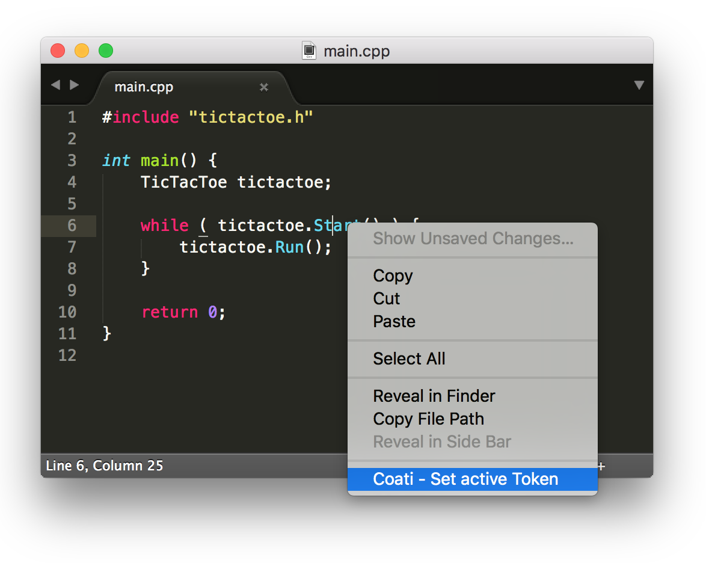

#############
sublime-sourcetrail
#############

sublime-sourcetrail is a plugin for Sublime to communicate with SourceTrail_.

.. _SourceTrail : https://sourcetrail.com

How to Install:
===============

Manually

    Just copy and past this folder into your Packages folder of Sublime Text. (You can find
    that folder from within Sublime via the menu: Preferences -> Browse Packages...). Restart Sublime before
    starting to use the plugin.

via Package Controll

Use
===

If you want Sublime to activate a certain element in SourceTrail, click a location to place the cursor,
right-click to bring up the context menu and choose the “SourceTrail - Set active Token” option.
Please note that the position of the cursor will be sent to SourceTrail and not the position you opened the context menu at.

License
=======

MIT

